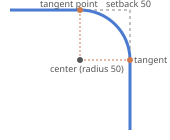
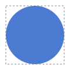

# F01 — A rectangle with rounded corners

## What you can do now

Type a width, a height and a corner radius: the rectangle is drawn with its corners rounded, exactly, in the playground. When the radius you ask for is too big for the rectangle, it is reduced just enough to fit, and the page tells you so — your number is kept, and the rounding grows back when the rectangle grows.

## The ideas behind it

**Rounding a corner.** A rounded corner is a sharp corner cut off by a small arc of circle, called a **fillet**. The arc touches the two sides of the corner at two **tangent points**; their distance to the corner is the **setback**. On a right angle, the setback equals the radius.

**Radius 10 on a 100 × 50 rectangle.** Each corner is replaced by a quarter circle of radius 10; between them, the sides stay straight.

**A radius too big.** On a side of 25, two corners of 100 cannot both fit: their arcs would overlap. The library reduces the radius until the arcs just meet in the middle of the side: 25 / 2 = **12.5**. The rule is _local_ and _proportional_: only the corners of the sides that are too short are reduced, and all in the same proportion (decision ADR-0007). The short sides become half circles — a "pill".

**A circle is a rounded square.** A square of 100 with radius 50 — half its side — is a circle. A radius of 1000 gives the same circle: it is reduced to 50.

| Term             | In plain words                                                                     |
| ---------------- | ---------------------------------------------------------------------------------- |
| Corner radius    | how much a corner is rounded; 0 means a sharp corner                               |
| Requested radius | the number you type; it is kept in the model                                       |
| Effective radius | the radius actually drawn; smaller when the rectangle is too small for the request |
| Fillet           | the arc of circle that replaces a corner                                           |
| Tangent point    | where the fillet touches a side                                                    |
| Setback          | distance from the corner to a tangent point                                        |
| Path data        | the text the SVG file uses to describe the outline (`M`, `L`, `A`, `Z` commands)   |

## Try it

Run `npm run dev` and open `http://localhost:5173`: the **Guided test** panel at the top right takes you through the nine steps of the test card one at a time — **Next** types the values for you, the panel says what happens and what to look at. The same steps are listed in the test card of [US-003](../backlog/stories/E01-F01-US-003-round-rectangle-corners.md#product-owner-test).

## Limits

- One radius for the whole rectangle: a radius per corner comes with F03 (node editing).
- Only rectangles: regular polygons come with F02.
- Open questions: a spike — a corner where the outline turns back on itself — is swallowed by its rounding (Q16).

## Your feedback

Said by the Product Owner during `VAL-001`, quoted by the agent.
