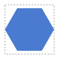
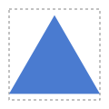
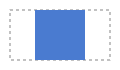
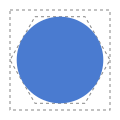
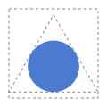
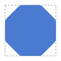

# F02 — A regular polygon with rounded corners

## What you can do now

In the playground, choose **Polygon** instead of Rectangle and type a number of corners, from 3 to 12. You get the largest **regular** polygon — all its sides and all its corners equal — that fits the box of the width and height you typed, without being stretched, centered in it, always with a flat side at the bottom. The corner radius works as for the rectangle: too big, it is reduced to fit, and your number is kept.

## The ideas behind it

**As large as the box allows, without stretching.** A hexagon in a 100 × 100 box is 100 wide but only 86.6 high: to touch the top and bottom too, it would have to be stretched, and it would no longer be regular. So it touches the width, and leaves a small margin above and below.

**A flat base, always.** A triangle points up, a square has horizontal sides — it is not a diamond. Another orientation (a diamond is a square turned by 45°) will come from free rotation, F04.

**It stays regular when the box changes.** A square in a 100 × 50 box is 50 × 50, centered across.

**Rounded as much as possible, a polygon becomes the circle inside it.** With a radius far too big, every corner is rounded until its curves meet in the middle of the sides: the hexagon becomes its inscribed circle, of diameter 86.6. It no longer touches the box — remove the rounding and it touches it again (accepted at the refinement).

The circle inside a triangle is smaller (radius 28.87), and lower than the middle of the box: it is centered on the triangle, not on the box.

**A small radius** rounds the corners and keeps the sides: an octagon with radius 10 touches all four sides of its box.

| Term             | In plain words                                                                      |
| ---------------- | ----------------------------------------------------------------------------------- |
| Regular polygon  | a shape with equal sides and equal corners; "equilateral" is the word for triangles |
| Box              | the width × height you type; the polygon fits inside it                             |
| Flat base        | a horizontal side at the bottom                                                     |
| Inscribed circle | the largest circle inside the polygon, touching every side in its middle            |
| Requested radius | the number you type; it is kept in the model                                        |
| Effective radius | the radius actually drawn; smaller when the shape is too small for the request      |

## Sizes

One unit of the drawing is one pixel of the screen. The calculations have no upper limit, but the interface caps a width, height or radius typed above 100 000 at 100 000: even a wall of 8K screens stays far below (Q20). For a screen seen from far, draw at the screen's size and let the SVG scale.

## Try it

Run `npm run dev` and open `http://localhost:5173`: the **Guided test** panel takes you through the steps one at a time — the nine of F01, then the eleven of F02 from step 10. **Next** types the values and chooses the shape for you. The same steps are listed in the test cards of [US-007](../backlog/stories/E01-F02-US-007-shape-selector-playground.md#product-owner-test) and [US-008](../backlog/stories/E01-F02-US-008-cap-playground-sizes.md#product-owner-test).

## Limits

- Regular polygons only: a polygon stretched to fill its whole box is planned as F06.
- One radius for every corner: a radius per corner comes with F03.
- Only a flat base: other orientations come with free rotation (F04).
- From 3 to 12 corners (Q19): symbols use up to 8, and beyond 12 a polygon is hardly told from a circle.

## Your feedback

Said by the Product Owner during `VAL-002` (2026-10-09), quoted by the agent: « J'ai lancé `npm run dev`, j'ai rien à dire, ça fonctionne comme je le voulais. » Ideas raised along the way: a stretched polygon (F06), the target screen asked by the View Editor (E08), oversized SVG imports flagged and simplified (E11).
